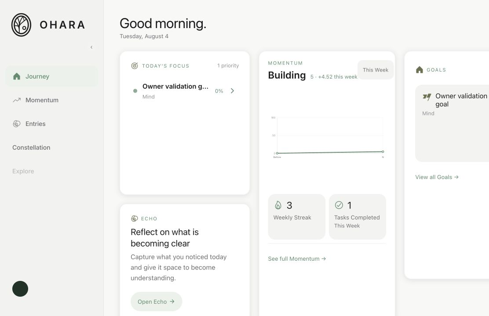
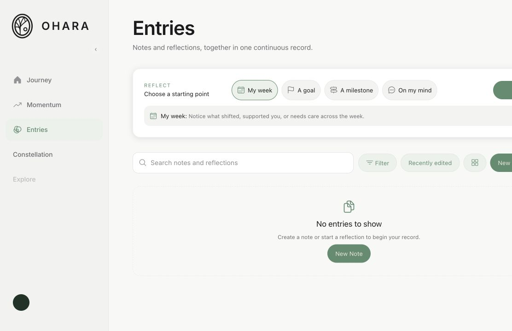
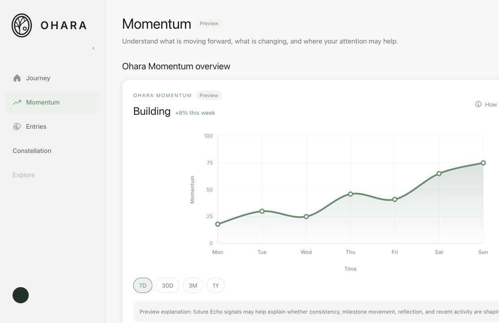
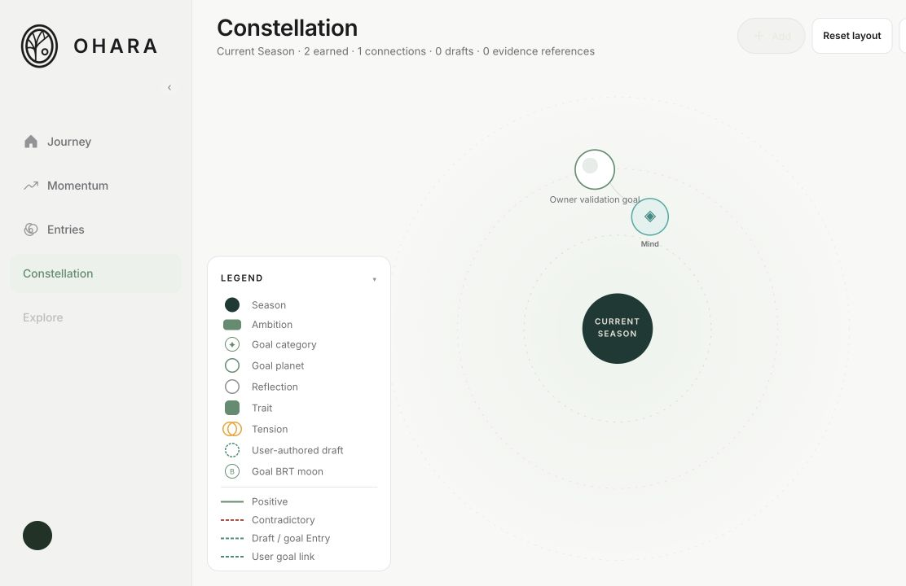
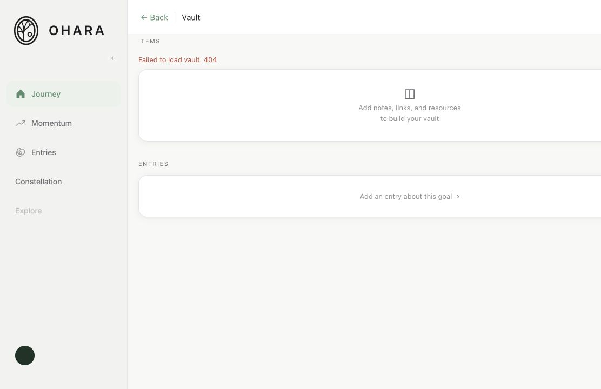

# Local Manual Review — Migrations 001–039

Date: 2026-08-04

Scope: isolated local Supabase stack and authenticated local web application

Review type: functionality, data integrity, security, runtime, and migration-repair regression review

Source changes made: none

Remote environments contacted: none

## Environment

| Item | Verified result |
|---|---|
| Web application | `http://127.0.0.1:8091` |
| Supabase API | `http://127.0.0.1:54321` |
| Local PostgreSQL | `127.0.0.1:54322` |
| Current branch | `design-system-v1` |
| Test account | `m***@local.ohara.test`; username `user_46…`; timezone `America/New_York` |
| Migration ledger | 39 rows, `001` through `039` |
| Public schema | 35 tables; RLS enabled on all 35 |

The repository target guard resolved `.env.local` to the loopback Supabase URL. The running web bundle contains `127.0.0.1:54321` and does not contain the configured hosted project hostname. Generic `example.supabase.co`, `realtime.supabase.co`, and `xyzcompany.supabase.co` strings are present inside third-party SDK source examples, but no hosted project URL appeared in application configuration, browser console output, or API execution.

The in-app browser does not expose a full DevTools network-request table or the browser Performance resource API. Network targeting was therefore cross-checked through the resolved environment, compiled runtime bundle, local API smoke test, local server URLs, browser console URLs, and database listener/ledger checks. No evidence of a remote request was found.

## Review Summary

One hundred review assertions were evaluated.

| Classification | Count |
|---|---:|
| PASS | 89 |
| COSMETIC | 4 |
| NON-BLOCKING FUNCTIONAL ISSUE | 4 |
| RELEASE BLOCKER | 0 |
| UNRELATED PRE-EXISTING ISSUE | 2 |
| REQUIRES PRODUCT DECISION | 1 |
| **Total** | **100** |

The migration-chain repair itself is healthy. No reviewed failure appears to have been introduced by the Migration 003 ordering correction, the restored `vector(1024)` declarations, or Migration 039. The authoritative Home Momentum result, snapshot chain, RLS state, and migration catalog remained stable throughout the review.

## Route-by-Route Results

### Authentication

| Check | Result | Evidence |
|---|---|---|
| Existing session restores | PASS | `/dashboard` loaded directly with the local fixture identity. |
| Refresh preserves session | PASS | Reload returned the authenticated Home screen. |
| Sign out | PASS | Returned to `/login`. |
| Authenticated-route protection | PASS | `/dashboard` redirected to `/login` while signed out. |
| Invalid credentials | PASS | Displayed `Incorrect email or password.` |
| Sign back in | PASS | Valid local credentials returned to `/dashboard`. |
| Cross-user data isolation | PASS | The current user saw only the owned goal and no other user's private goal content. |
| Post-login reconcile | NON-BLOCKING FUNCTIONAL ISSUE | One transient Echo reconcile `401 Unauthorized` warning appeared immediately after sign-in; subsequent Home, Entries, and Momentum reads succeeded. See F-01. |

### Home

| Check | Result | Evidence |
|---|---|---|
| Route/runtime health | PASS | `/dashboard` rendered without an error-level console event. |
| Local identity | PASS | Account/friends dialog showed the masked local fixture identity `@user_46…`. |
| Goal data | PASS | `Owner validation goal`, category `Mind`, progress `0%`. |
| Projects state | PASS | Empty state rendered before the disposable project test; the created project then appeared and was removed after validation. |
| Echo/Entries action | PASS | `Open Echo` routed to the canonical `/entries` workspace. |
| Navigation | PASS | Journey, Momentum, Entries, Constellation, account, settings, goal, and create entry points opened. |
| Empty/populated transitions | PASS | Empty project/entry states and populated goal/Momentum states rendered without crashing. |
| Momentum status/value | PASS | `Building`, rendered as `5 · +4.52 this week`; authoritative exact value is `4.5192`. |
| Weekly Streak | PASS | `3`. |
| Tasks Completed This Week | PASS | `1`. |
| Deterministic reload | PASS | Snapshot state remained `3 rows | max revision 3 | 3 distinct hashes` before and after reload and the API smoke test. |



### Goals

| Check | Result | Evidence |
|---|---|---|
| Card navigation | PASS | Home card opened `/goals/74cf5899-…`. |
| Detail loading | PASS | Owned goal title, category, status, description, and progress rendered. |
| Milestones/trackers/activity | PASS | Zero-state milestone and tracker panels rendered; `Goal created` activity was present. |
| Goal creation entry | PASS | Four-step creation flow opened with manual/Echo modes and category choices. |
| Cancel/back | PASS | Returned to Journey without a crash. The workflow retained its existing draft behavior and displayed `Saved as draft`. |
| Category readability | PASS | Goal Detail and Home consistently showed the fixture's canonical `Mind` category. |
| Placeholder panels | UNRELATED PRE-EXISTING ISSUE | Goal Detail includes explicitly labeled example/sample/placeholder Intelligence, Momentum, Analytics, and recommendation panels. No sample value is presented as authoritative. See F-06. |

The three-user fixture contains one goal per test user. Directly navigating as the current user to another fixture user's goal ID disclosed no private data, satisfying the ownership boundary. The denial screen remained blank instead of reaching the existing not-found state; see F-04.

### Echo

`/echo` intentionally redirects to `/entries`; `app/(app)/echo.tsx` is a redirect compatibility route. The current sidebar and Home Echo action also use the unified Entries workspace.

| Check | Result | Evidence |
|---|---|---|
| Compatibility route | PASS | `/echo` redirected locally to `/entries`. |
| Legacy container/tree, list/detail panes, filters, action menus, composer, and move/folder dialogs | REQUIRES PRODUCT DECISION | Legacy components remain in `features/echo/components/`, but the active route does not render them. Decide whether the requested legacy Echo review remains applicable or whether the unified Entries workspace formally supersedes it. See F-07. |

The active reflective flow was reviewed through Entries and behaved correctly. Echo did not present another user's records.

### Entries

| Check | Result | Evidence |
|---|---|---|
| Unified Notes/reflections library | PASS | `/entries` loaded search, filter, sort, note creation, and reflection launcher controls. |
| Empty state | PASS | `No entries to show` rendered without crashing. |
| Note creation | PASS | A disposable local note opened at a real `/entries/:id` route. |
| Edit/autosave/reload | PASS | Updated title/content showed `Saved` and persisted after reload. |
| Goal/category linking | PASS with issue | Specific-goal and category links persisted after reload; the goal's category label was inconsistent. See F-02. |
| Delete confirmation | PASS | Confirmation warned that deletion is irreversible; deletion returned to the empty library. |
| Reflection launch | PASS | `On my mind` opened `/entries/reflection?type=open` with a real guided prompt and disabled empty Send action. |
| Exit without completion | PASS | `Keep reflecting` and Back returned safely without creating a disposable completed reflection. |



### Momentum

| Check | Result | Evidence |
|---|---|---|
| Page loads | PASS | `/momentum` rendered without an error-level console event. |
| Authenticated API | PASS | Local API smoke returned the authoritative fixture response. |
| Unauthorized API | PASS | No-credential Momentum request returned `401`. |
| Home agreement | NON-BLOCKING FUNCTIONAL ISSUE | Full Momentum remains an explicitly labeled preview (`+8%`, sample chart) and does not display Home's authoritative `4.5192` result. This is the documented Phase 1 scope boundary, not a migration regression. See F-03. |
| Weekly diagnostics | PASS | `calculationVersion=momentum-v1.0`, three included events, zero excluded events. |
| Reason codes | PASS | `CONSISTENCY_HIGH` and `GOAL_PROGRESS` returned. |
| Idempotency | PASS | Repeated identical API/Home reads did not create a fourth snapshot revision. |
| Immutability | PASS | Enabled mutation-rejection trigger; authenticated role has SELECT but no INSERT/UPDATE/DELETE on Momentum snapshots. |
| Client trust boundary | PASS | Home performs a GET to `/api/momentum`; scores, hashes, aggregates, reasons, and revisions are calculated server-side. Forged query values were ignored by the smoke test. |

Sanitized local API example:

```json
{
  "algorithmVersion": "momentum-v1.0",
  "status": "Building",
  "currentValue": 4.5192,
  "weeklyChange": 4.5192,
  "weeklyStreak": 3,
  "tasksCompletedThisWeek": 1,
  "diagnostic": {
    "includedEvents": 3,
    "excludedEvents": 0,
    "reasonCodes": ["CONSISTENCY_HIGH", "GOAL_PROGRESS"]
  },
  "unauthorizedStatus": 401,
  "forgedQueryIgnored": true
}
```



### Constellation

| Check | Result | Evidence |
|---|---|---|
| Route loads | PASS | `/constellation` loaded two earned nodes and one connection. |
| Nodes/edges | PASS | Current Season, Mind category, owned goal, and category-membership edge rendered. |
| Pan | PASS | Visualization transform moved from `(0,0)` to `(50,25)` after a background drag. |
| Zoom | PASS | Zoom control accepted input without runtime or permission errors. |
| Fit/recenter | PASS | Fit restored visualization translation to `(0,0)` at scale `1`. |
| Node selection | PASS | Clicking the visual owned-goal node opened and closed selection. |
| Inspector | PASS | Goal inspector showed owned goal metadata, links, entries, and evidence empty states. |
| Category identity | PASS | Mind retained its teal category treatment; the OHARA green did not overwrite it. |
| Accessible representation | PASS | Semantic node buttons and a one-connection text summary were present. |
| Field/rings structure | PASS | Radial field and three dashed rings share Current Season coordinates `(600,380)`; field uses `userSpaceOnUse`; rings render above it. |

The rendered graph used light ring opacities `0.24`, `0.18`, and `0.12` with radii `138`, `236`, and `342`. No Constellation permission error appeared.



### Friends

| Check | Result | Evidence |
|---|---|---|
| Friends list | PASS | Empty owned list rendered. |
| Requests | PASS | Empty Sent/Requests states rendered. |
| Add-people search | PASS | Search returned the three local fixture usernames; the current account was labeled `You`. |
| Accepted/pending states | PASS / fixture-limited | `friend_connections` contains no rows, so empty states were correct; no accepted/pending row was available for manual selection. |
| Cross-user privacy | PASS | Search exposed only intended username/discovery data; no private goal, Entry, or project data appeared. |
| Unauthorized endpoint | PASS | No-credential `/api/friends` request returned `401`. |
| Direct friendship mutation boundary | PASS by catalog/repository evidence | Authenticated role has SELECT only on `friend_connections`; Migration 039 did not restore direct mutation. |
| Anonymous data access | PASS | Anonymous role has zero public-table SELECT/INSERT/UPDATE/DELETE privileges. |

No friend request was sent, because the fixture had no reciprocal signed-in session available for safe cleanup.

### Projects

| Check | Result | Evidence |
|---|---|---|
| Creation dialog | PASS | Name/intent validation and disabled empty submit rendered. |
| Disposable creation | PASS | Created project appeared on Home with `0 goals connected`. |
| Detail route | PASS | `/projects/:id` loaded the owned project's title, intent, status, and empty goals state. |
| Relationships | PASS | Correctly displayed zero connected goals for the disposable project. |
| Edit | PASS | Updated project title persisted in the detail view. |
| Delete confirmation | PASS | Explicit irreversible confirmation opened. |
| Delete/cleanup | PASS | Confirmed deletion returned to Home and removed the project. |
| Vault | UNRELATED PRE-EXISTING ISSUE | Valid owned-goal Vault route displayed `Failed to load vault: 404` when no vault row existed. See F-05. |



### Settings and secondary routes

| Check | Result | Evidence |
|---|---|---|
| Account/friends dialog | PASS | Identity, Friends, Requests, and Add people opened. |
| Settings | PASS | Appearance, AI Reflections, and Archived sections opened; Archived empty state rendered. |
| Explore | PASS | Direct `/explore` showed the intentional `Explore is coming` placeholder without crashing. |
| Not found | PASS | Unknown route showed `This screen doesn't exist.` and a Home link. |
| Global Create | PASS | Control remained present across authenticated routes. |

## Browser Evidence

### Console findings

No error-level console entry, unhandled rejection, hydration warning, render loop, or repeated Momentum publication error was observed.

Distinct warnings:

1. **F-01:** one `Echo reconcile: fetch error: UnauthorizedError: Unauthorized` immediately after sign-in.
2. Require cycles through `lib/api/client.ts`, `store/clearAllStores.ts`, and Echo/Friends/Entries stores.
3. React Native Web deprecations for `Image.style.tintColor`, `props.pointerEvents`, and `shadow*` style props.
4. Web fallback warning for `Animated.useNativeDriver`.
5. One transient Metro websocket disconnect (`1006`) during the long development review; HTTP navigation and the application remained operational.

All console URLs were served from the local `127.0.0.1:8091` bundle.

### Network and request findings

| Request/action | Result |
|---|---|
| Authenticated `/api/momentum` | `200`, authoritative local response |
| Unauthenticated `/api/momentum` | `401` |
| Forged Momentum query values | Ignored |
| Unauthenticated `/api/friends` | `401` |
| Owned goal without a Vault row | `/api/vaults/:goalId` returned `404`; surfaced by UI |
| Runtime Supabase target | `127.0.0.1:54321` |
| Hosted configured project hostname in runtime bundle | Absent |

## Database and Security Checks

| Check | Result |
|---|---|
| Migration ledger | PASS — 39 rows, `001`–`039` |
| Public tables | PASS — 35 |
| RLS | PASS — 35/35 enabled |
| `space_members` ordering | PASS — Migration 003 creates the relation and its policies before installing the `spaces` membership-read policy |
| Embedding typmods | PASS — `echo_entries.embedding`, `goals.embedding`, and `vault_items.embedding` are `vector(1024)` |
| HNSW indexes | PASS — all three are `indisvalid=true` and `indisready=true` |
| Migration 039 PostgREST data grants | PASS — anonymous role has zero public-table CRUD; authenticated friendship and Momentum direct writes remain absent |
| Momentum immutability | PASS — enabled `BEFORE UPDATE OR DELETE` rejection trigger |
| Snapshot supersession | PASS — revisions 1→2→3 each link to the immediately preceding snapshot |
| Snapshot reproducibility | PASS — three rows, three distinct hashes, stable maximum revision 3 after repeated reads |

The local Supabase baseline also exposes inherited non-PostgREST privileges such as `REFERENCES`, `TRIGGER`, and `TRUNCATE` to the standard JWT roles. Migration 039 did not introduce these privileges, and the client-facing PostgREST data surface remains the intended explicit CRUD matrix with RLS. An ACL diff remains recommended before staging, as already documented in `docs/SUPABASE_MIGRATION_CHAIN_REPAIR.md`.

Cross-user review used another fixture user's goal ID while authenticated as `user_46…`. No goal content was returned. The UI did not present a clean not-found message, but the ownership boundary held.

## Momentum Verification

- Home values match the validated local fixture: current Momentum `4.5192`, Weekly Streak `3`, Tasks Completed This Week `1`.
- API status is `Building`; weekly change is `4.5192`.
- Calculation version is `momentum-v1.0`.
- Diagnostics contain three included events, zero excluded events, and two reason codes.
- The persisted fixture revision chain under review has `week_start=2026-07-27`, a six-day `week_end`, and timezone `America/New_York`; the API and stored diagnostic boundaries were internally consistent.
- Existing revisions are `1`, `2`, and `3`; supersession links are correct.
- Reopening/reloading Home and rerunning the authenticated API smoke test left the row count, revision, and hash count unchanged at `3|3|3`.
- Authenticated users can SELECT their own Momentum snapshot through RLS but cannot INSERT, UPDATE, or DELETE snapshots.
- The enabled database trigger rejects snapshot UPDATE/DELETE even through a privileged mutation path.
- The client hook issues only GET `/api/momentum`; the service calculates and publishes derived values behind the server boundary.
- The full Momentum workspace remains a labeled preview and is not yet wired to these authoritative values (F-03).

## Findings Requiring Action

### F-01 — Post-login Echo reconcile emits a transient 401

- **Classification:** NON-BLOCKING FUNCTIONAL ISSUE
- **Route/action:** Sign out, sign in with the valid local account, land on `/dashboard`.
- **Expected:** Reconcile waits for/restores the fresh authenticated session without an authorization warning.
- **Actual:** One `Echo reconcile: fetch error: UnauthorizedError: Unauthorized` warning appears; subsequent authenticated reads work.
- **Console/network evidence:** Local bundle stack points to `authedFetch` and `reconcile`; no repeating 401 followed.
- **Likely subsystem:** `features/echo/services/echo-service.ts`, `lib/api/client.ts`, auth/store restoration.
- **Migration-repair introduction:** No. It is an application auth-timing issue.

### F-02 — Entries maps the fixture's legacy `Mind` goal to `Education`

- **Classification:** NON-BLOCKING FUNCTIONAL ISSUE
- **Route/action:** Create/open a note, open `Link this entry`, inspect `Owner validation goal`.
- **Expected:** The goal category label agrees with Home, Goal Detail, and Constellation (`Mind`).
- **Actual:** Link picker shows `Education · active`; the link itself saves correctly.
- **Console/network evidence:** No request or console failure; persisted specific-goal/category links survived reload.
- **Likely subsystem:** `lib/goals/catalog.ts` legacy `mind → education` normalization and `features/entries/components/EntryLinkPicker.tsx`.
- **Migration-repair introduction:** No. This is presentation taxonomy mapping.

### F-03 — Full Momentum preview disagrees with authoritative Home/API values

- **Classification:** NON-BLOCKING FUNCTIONAL ISSUE
- **Route/action:** Compare `/dashboard` Momentum with `/momentum`.
- **Expected:** Current values agree if the full route is treated as live Momentum.
- **Actual:** Home/API show `4.5192`, streak `3`, tasks `1`; full route is explicitly labeled `Preview` and shows static `+8%`/sample chart content.
- **Console/network evidence:** Authenticated local API smoke passed and returned the authoritative values; no page request error.
- **Likely subsystem:** `app/(app)/momentum.tsx`.
- **Migration-repair introduction:** No. The Phase 1 reports explicitly scoped authoritative integration to Home and deferred full Momentum UI.

### F-04 — Cross-user Goal route denies data but remains blank

- **Classification:** NON-BLOCKING FUNCTIONAL ISSUE
- **Route/action:** While signed in as `user_46…`, navigate directly to another fixture user's `/goals/:id`.
- **Expected:** No data disclosure and a clear not-found/unauthorized-safe state.
- **Actual:** No other-user data appears, but only the application shell/global Create control remains; the existing `GoalNotFound` state is not reached.
- **Console/network evidence:** No sensitive content or error-level console event.
- **Likely subsystem:** `features/goals/hooks/useGoalDetail.ts`, shared goal-store loading state, and `app/(app)/goals/[id]/index.tsx`.
- **Migration-repair introduction:** No evidence. RLS denial is correct; this is route-state handling.

### F-05 — Empty owned Vault is surfaced as a 404 error

- **Classification:** UNRELATED PRE-EXISTING ISSUE
- **Route/action:** Open `/goals/74cf5899-…/vault` for the valid owned fixture goal, which has no Vault row.
- **Expected:** Empty Vault state, or lazy creation through the intended application flow.
- **Actual:** UI displays `Failed to load vault: 404` above the empty content.
- **Console/network evidence:** `GET /api/vaults/:goalId` intentionally returns `404` when `getVaultByGoalIdForUser` returns null; `useVault` converts every non-OK response to an error.
- **Likely subsystem:** `app/api/vaults/[goalId]+api.ts`, `features/goals/hooks/useVault.ts`, and Vault lifecycle creation.
- **Migration-repair introduction:** No. The relevant route and data behavior predate the chain repair.

### F-06 — Goal Detail contains labeled static preview panels

- **Classification:** UNRELATED PRE-EXISTING ISSUE
- **Route/action:** Open the owned goal detail.
- **Expected:** Real data where implemented and clear unavailable/preview states elsewhere.
- **Actual:** Intelligence, Goal Momentum, Analytics, and recommendation panels contain explicitly labeled example/sample/placeholder content.
- **Console/network evidence:** No failure; labels state `Example insight`, `Sample data · integration pending`, and `Placeholder recommendations only`.
- **Likely subsystem:** Goal detail presentation components and preview selectors.
- **Migration-repair introduction:** No.

### F-07 — Echo review contract no longer matches the active route

- **Classification:** REQUIRES PRODUCT DECISION
- **Route/action:** Open `/echo`.
- **Expected by this review request:** Legacy container/tree, list/detail, filters, composer, and move/folder dialogs.
- **Actual:** Compatibility route redirects to canonical `/entries`; legacy Echo components are not mounted.
- **Console/network evidence:** Local redirect only; Entries loads normally.
- **Likely subsystem:** `app/(app)/echo.tsx` and the Entries/Echo product information architecture.
- **Migration-repair introduction:** No. The redirect is an intentional application change.

### Cosmetic observations

1. Require-cycle warnings in Echo, Friends, and Entries through `clearAllStores`.
2. React Native Web deprecation warnings for tint, pointer events, and shadow props.
3. Web animation falls back from `useNativeDriver` to JavaScript.
4. One transient Metro development websocket disconnect occurred; page HTTP/runtime behavior remained healthy.

## Limitations

- The fixture has no accepted or pending friend connections, so only correct empty states, discovery search, endpoint authorization, and database capabilities were reviewed manually.
- The active Echo route no longer renders the legacy Echo workspace.
- The full network waterfall and request-body viewer are not exposed by the in-app browser. The Momentum GET-only client boundary was verified through source, local API behavior, forged-query rejection, and stable database state.
- Error states were exercised where naturally reachable (Vault, invalid auth, unauthorized/cross-user routes); no artificial service outage was introduced.

## Recommendation

**Ready with documented non-blocking issues.**

The repaired migration chain is ready to commit for manual approval. The local catalog, RLS coverage, embedding indexes, Migration 039 PostgREST data permissions, Momentum publication boundary, deterministic Home result, and snapshot history all passed. No release blocker was found that appears related to the migration-chain repair. Address or separately triage F-01 through F-07 before treating every secondary application workflow as production-complete, especially the Vault empty-state contract and the decision about whether legacy Echo remains a supported surface.
